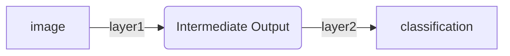
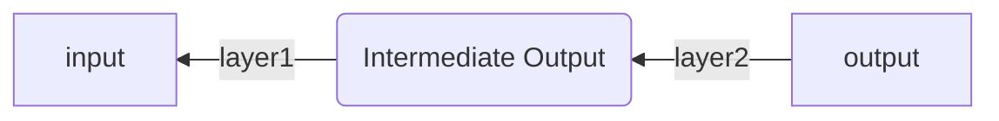

# Neural Network from Scratch

A minimal neural network implementation for training and inference, built from scratch with NumPy. On a MacBook Air M2, one training epoch takes approximately 20 seconds. PyTorch is used only for its DataLoader to keep data loading simple.

This repository is designed to illustrate the core ideas behind neural networks and modern large language models (LLMs) through a small but functional implementation. The goal is to keep the code simple, readable, and easy to follow, making it useful for tutorials, self-study, and review.

The implementation currently supports:

* Convolutional layers
* Fully connected layers
* Sigmoid activation
* Softmax activation
* Training and inference from scratch
* Reconfigurable model architecture

## Motivation

I tend to forget knowledge easily. Although I studied computer science during my bachelor's and master's degrees, I am now working in computer architecture and hardware verification.

At one point, I wanted to revisit the theory of neural networks, but I realized that I could no longer remember it clearly. This repository documents the theory, code, and comments that help me, and hopefully you, revise the fundamentals and build a neural network from scratch.

## Installation

1. Optional: create a Python virtual environment.

   Recommended Python version: `3.11.15`

2. Clone the repository.

```bash
git clone https://github.com/AllinLeeYL/neural-network-from-scratch.git
```

3. Install the dependencies.

```bash
pip install torch torchvision matplotlib pickle # or: pip install -r requirements.txt
```

4. Run the training script. The model with best performance will be saved.

```bash
python3 train.py
```

5. Test the model. Images and predictions will be saved to `prediction.jpg`.

```bash
python3 test.py
```

## Notes

The model arch is not fixed, meaning the network strucute can be reconfigured simply by modifing only the variable `SimpleNetwork.graph` in `model.py`. For example, the model architecture can be changed to 2 conv2d + 1 fully connected like this:

```python
    self.graph = [
        Conv2dLayer(1, 10, 5, padding=1),
        Sigmoid(),
        Pooling(),
        Conv2dLayer(10, 20, 5, padding=1),
        Flatten(),
        FullyConnectedLayer(11 * 11 * 20, 10),
        Softmax()
    ]
```

or even simpler two-layer fully connected architecture like this:

```python
    self.graph = [
        Flatten(),
        FullyConnectedLayer(28 * 28, 22 * 22),
        FullyConnectedLayer(22 * 22, 10)
    ]
```

## Forward Propagation and Backward Propagation

Consider an example where we have a handwritten digit image consisting of `28 × 28` pixels. The goal is to classify the image as one of the digits from `0` to `9`.



The process of moving data from the model input to the output is called **forward propagation**.

In contrast, **backward propagation** is the process of calculating gradients and updating parameters by applying the chain rule from the model output back toward the input.



## Theory of Forward Propagation

Model is just a macro of big multivariate equations.

Take fully-connected layer for example, for each output value `y`, the layer computes the weighted sum of all input values `x`, then adds a bias term:

$$
y = \sum_i x_i w_i + b
$$

In matrix form, the output `Y` is calculated as:

$$
Y = XW + B
$$

For a single input sample, the dimensions are:

* $Y$: `(output_dim)`
* $X$: `(input_dim)`
* $W$: `(input_dim, output_dim)`
* $B$: `(output_dim)`

## Theory of Backward Propagation

Backward propagation is just calculating derivatives.

For simplification, image that we have a output $y$ respect to the input $t$. This defines a simple 2-layer, one-input and one-output neural network.

$$
y = w_y x + b_y
$$

while,

$$
x = w_x t + b_x
$$

### Loss Function

The goal of training a model is to make its predictions as close as possible to the target labels. To do this, we need a loss function to measure how well or poorly the model performs.

In this example, we use cross-entropy loss:

$$
loss = \sum -\hat{y} \ln(y)
$$

This loss function measures how far the model prediction is from the target. 

### Backward Propagation

With the help of a loss function, we have can express the equation from input to loss as:

$$
Loss = h(...g(f(x_1, x_2, \dots, w_1, w_2, \dots))...)
$$

Training the model then becomes the process of minimizing this loss by updating the model parameters.

For each parameter, we need to determine both the direction and the size of the update: should the weight increase or decrease, and by how much? This is done by computing derivatives and applying small updates to the parameters.

### The Chain Rule

Because derivatives can be calculated using **the chain rule**, we can first compute the derivative of the loss with respect to the final output:

$$
\frac{\partial loss}{\partial y}
$$

And then use the derivative to calculate the derivate of weights for $y$.

$$
\frac{\partial loss}{\partial w_y} = \frac{\partial loss}{\partial y}\frac{\partial y}{\partial w_y}
$$

In the meantime, we have to calculate the derivate of $x$, because we have to move backward to the next layer.

$$
\frac{\partial loss}{\partial x} = \frac{\partial loss}{\partial y}\frac{\partial y}{\partial x}
$$

We can then use the chain rule to continue calculate the derivate of $w_x$.

$$
\frac{\partial loss}{\partial w_x} = \frac{\partial loss}{\partial y} \frac{\partial y}{\partial x} \frac{\partial x}{\partial w_x}
$$

Then, we continue moving backward through the network recursively, until there is no more layers left and we have calculated all the derivates for every weights and bias.

We then update them using gradient descent as follows:

$$
w = w - \alpha \frac{\partial loss}{\partial w}
$$

Here, $\alpha$ is the learning rate.


