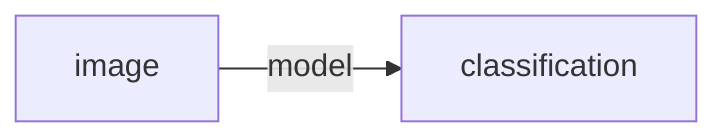
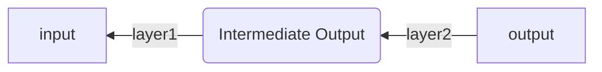

# Neural Network from Scratch

A minimal neural network implementation for training and inference, built from scratch using NumPy. PyTorch is used only for its `DataLoader` to simplify data loading.

This repository aims to illustrate the theory behind neural networks and modern large language models (LLMs) by implementing a small but functional neural network. The goal is to keep the code as simple and readable as possible, making it useful for tutorials, learning, and revision.

The implementation currently supports:

* Convolutional layers
* Fully connected layers
* Sigmoid activation
* Softmax activation
* Training and inference from scratch
* flexible model architecture

## Motivation

I tend to forget knowledge easily. Although I studied computer science during my bachelor's and master's degrees, I am now working in computer architecture and hardware verification.

At one point, I wanted to revisit the theory of neural networks, but I realized that I could no longer remember it clearly. This repository documents the theory, code, and comments that help me, and hopefully you, revise the fundamentals and build a neural network from scratch.

## Installation

1. Optional: create a Python virtual environment.

   Recommended Python version: `3.11`

2. Clone the repository.

```bash
git clone https://github.com/AllinLeeYL/neural-network-from-scratch.git
```

3. Install the dependencies.

```bash
pip install torch torchvision matplotlib pickle # or: pip install -r requirements.txt
```

4. Run the training script.

```bash
python3 train.py
```

## Notes

The model arch is not fixed, meaning the network strucute can be altered simply by modifing only the `self.graph` variable. The model architecture can be changed to 2 conv2d + 1 fully connected like this:

```python
    self.graph = [
        Conv2dLayer(1, 10, 5, padding=1),
        Sigmoid(),
        Pooling(),
        Conv2dLayer(10, 20, 5, padding=1),
        Flatten(),
        FullyConnectedLayer(11 * 11 * 20, 10),
        Softmax()
    ]
```

or even simpler two-layer fully connected architecture like this:

```python
    self.graph = [
        Flatten(),
        FullyConnectedLayer(28 * 28, 22 * 22),
        FullyConnectedLayer(22 * 22, 10)
    ]
```

## Forward Propagation and Backward Propagation

Consider an example where we have a handwritten digit image consisting of `28 × 28` pixels. The goal is to classify the image as one of the digits from `0` to `9`.



The process of moving data from the model input to the output is called **forward propagation**.

In contrast, **backward propagation** is the process of calculating gradients and updating parameters by applying the chain rule from the model output back toward the input.



## Theory of Forward Propagation

### Fully Connected Layer

For each output value `y`, the layer computes the weighted sum of all input values `x`, then adds a bias term:

$$
y = \sum_i x_i w_i + b
$$

In matrix form, the output `Y` is calculated as:

$$
Y = XW + B
$$

For a single input sample, the dimensions are:

* $Y$: `(output_dim)`
* $X$: `(input_dim)`
* $W$: `(input_dim, output_dim)`
* $B$: `(output_dim)`

## Theory of Backward Propagation

The goal of training a model is to make its predictions as close as possible to the target labels. To do this, we need a loss function to measure how well or poorly the model performs.

In this case, we use cross-entropy loss:

$$
loss = \sum -\hat{y} \ln(y)
$$

This loss function measures how far the model prediction is from the target. Therefore, training the model becomes the process of minimizing the loss by updating the model parameters.

Naturally, this becomes a process of calculating derivatives and applying small updates to the parameters. For example, a weight can be updated as follows:

$$
w = w - \alpha \frac{\partial loss}{\partial w}
$$

Here, $\alpha$ is the learning rate.

Because derivatives can be calculated using **the chain rule**, we can first compute the derivative of the loss with respect to the final output:

$$
\frac{\partial loss}{\partial y}
$$

Then, we continue moving backward through the network. For example, the derivative with respect to an earlier variable can be calculated as:

$$
\frac{\partial loss}{\partial y} \frac{\partial y}{\partial x}
$$

By applying this process recursively, we obtain the gradients for all trainable parameters in the model.
